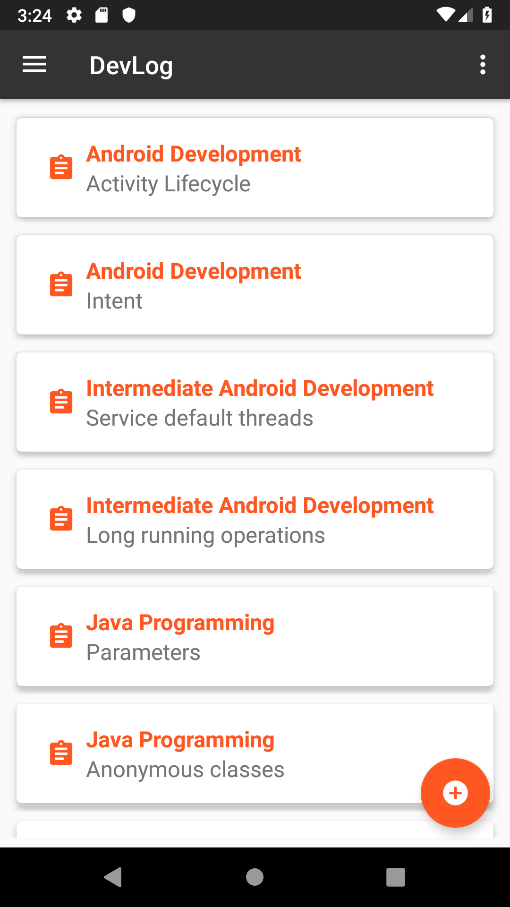
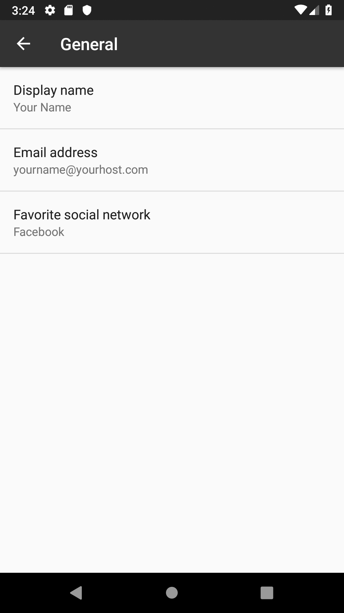

# DevLog
> Developer activity logger for Android.

## Table of contents
* [General info](#general-info)
* [Screenshots](#screenshots)
* [Status](#status)

## General info
A simple Android application to keep track of developers' courses and projects.
Add, modify and save your course and/or project progress easily!

## Screenshots

## Status
Project is: _in progress_
* Basic app skeleton...:heavy_check_mark:
* Implementing SQLite data persistence...:hourglass_flowing_sand:
